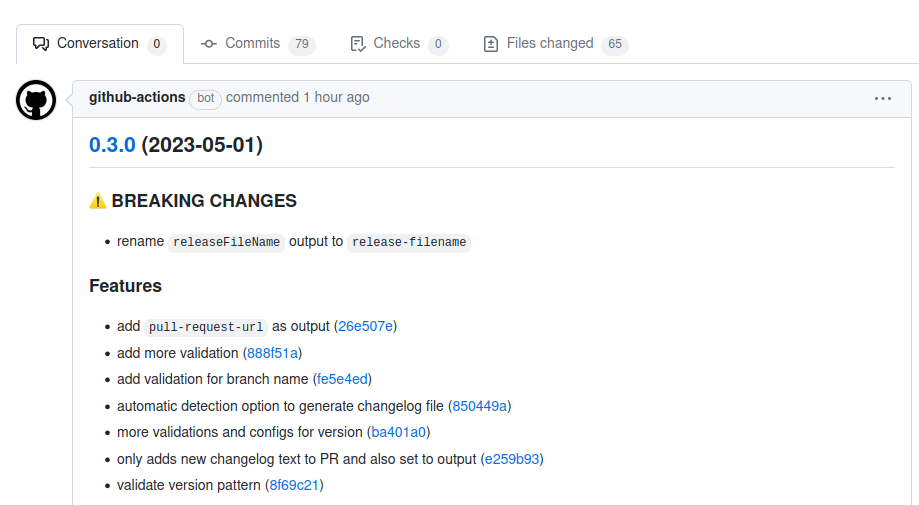

<div align="center">
  <h1>release-sv-action</h1>
  <br />
  <a href="#getting-started"><strong>Getting Started »</strong></a>
  <br />
  <br />
  <a href="https://github.com/Payadel/release-sv-action/issues/new?assignees=&labels=bug&template=BUG_REPORT.md&title=bug%3A+">Report a Bug</a>
  ·
  <a href="https://github.com/Payadel/release-sv-action/issues/new?assignees=&labels=enhancement&template=FEATURE_REQUEST.md&title=feat%3A+">Request a Feature</a>
  .
  <a href="https://github.com/Payadel/release-sv-action/issues/new?assignees=&labels=question&template=SUPPORT_QUESTION.md&title=support%3A+">Ask a Question</a>
</div>

<div align="center">
<br />

[](https://github.com/Payadel)

[](https://github.com/Payadel/release-sv-action/blob/main/.github/workflows/build-test.yml)
[](https://github.com/Payadel/release-sv-action/releases)


[](https://github.com/Payadel/release-sv-action/issues?q=is%3Aissue+is%3Aopen+label%3A%22help+wanted%22)

</div>

## About

### Introduction

`release-sv-action` is a GitHub Action that simplifies the process of creating a release based on
the [standard-version](https://www.npmjs.com/package/standard-version) npm package. The action automates the creation of
**tags**, **release files**, **pull requests**, and **changelogs**, and provides flexibility in configuring the process
to suit the needs of the user.

### Problem

Creating a release for a GitHub repository can be a time-consuming and error-prone process, especially if the repository
has a large number of commits and contributors. Additionally, keeping track of version numbers and changelogs can be
difficult and prone to human error. `release-sv-action` aims to solve these problems by automating the release process
and
generating accurate changelogs.

### Benefits

The benefits of using `release-sv-action` include:

- **Automated release process:** The action automates the creation of tags, release files, pull requests, and
  changelogs,
  making the release process faster and more efficient.
- **Accurate changelogs:** `release-sv-action` generates accurate changelogs based on the commits in the repository,
  reducing
  the likelihood of human error.
- **Flexibility:** The action can be configured to suit the needs of the user, including the ability to create pull
  requests for different branches and generate new changelogs only when necessary.
- **Improved developer experience:** By automating the tedious parts of the release process, developers can focus on
  writing
  code and building new features.

### Demo

**Screenshot**: If the software has visual components, place a screenshot after the description; e.g.,

<details>
<summary>Screenshots</summary>
<br>



</details>

### Built With

`release-sv-action` is built with the following technologies:

- **Node 18** - JavaScript runtime
- **TypeScript** - Typed superset of JavaScript
- **Jest** - Testing framework
- **GitHub Actions** - Continuous Integration and Deployment (CI/CD) tool

Additionally, the following dependencies are used:

- **standard-version** - A package for managing versions and generating changelogs
- **@actions/core** - GitHub Actions toolkit for setting outputs and inputs
- **@actions/exec** - GitHub Actions toolkit for executing commands

The full list of dependencies can be found in the [package.json](package.json) file.

## Getting Started

### Prerequisites

Before using `release-sv-action`, you need to ensure that the following prerequisites are met:

- You must have a GitHub account and have write access to the repository where you want to use this action.
- You should be familiar with GitHub Actions and how to create and run workflows.
- `package.json` file with a valid version number: This project is
  based [standard-version](https://www.npmjs.com/package/standard-version) npm package that uses the `package.json` for
  managing versions.
- It is better that your commits are based on the [conventional commits](https://www.conventionalcommits.org/en/v1.0.0/)
  standard.

If you are not familiar with these technologies, you may want to read the relevant documentation before using this
action.

## Usage

To use `release-sv-action` in your GitHub Actions workflow, you can add the following code to your
.github/workflows/release.yml file:

```yaml
name: Release

on:
  push:
    branches:
      - main
  workflow_dispatch:
    inputs:
      version:
        required: false
        default: ''
      generate-changelog:
        type: choice
        default: auto
        options:
          - never
          - always
          - auto
      create_pr_for_branch:
        required: false
        default: 'main'
        description: Target branch? empty for skip.

permissions:
  contents: write
  pull-requests: write

jobs:
  release:
    runs-on: ubuntu-latest

    # Limit branch:
    if: github.ref == 'refs/heads/main'
    # Or
    #if: github.ref != 'refs/heads/main'

    steps:
      - uses: actions/checkout@v3
        with:
          fetch-depth: 0

      - uses: Payadel/release-sv-action@v0.3.0  # Ensure version is latest
        id: release
        with:
          version: ${{ inputs.version }}
          generate-changelog: ${{ inputs.generate-changelog }}
          create-pr-for-branch: ${{ inputs.create_pr_for_branch }}
        env:
          GITHUB_TOKEN: ${{ secrets.GITHUB_TOKEN }}

      - name: Print outputs
        run: |
          echo "version: ${{ steps.release.outputs.version }}"
          echo "pull-request-url: ${{ steps.release.outputs.pull-request-url }}"
          echo "release-filename: ${{ steps.release.outputs.release-filename }}"

      - name: GitHub Release
        uses: ncipollo/release-action@v1
        with:
          artifacts: '${{ steps.release.outputs.release-filename }}'
          allowUpdates: true
          body: ${{ steps.release.outputs.changelog }}
          tag: 'v${{ steps.release.outputs.version }}'

```

The above code is a YAML file that provides a Github Actions workflow for using the `Payadel/release-sv-action` action.
This workflow is triggered on every push to the main branch or when manually triggered using the workflow dispatch
event.

The workflow accepts several inputs, including `version`, `generate-changelog`, and `create_pr_for_branch`. These inputs
can be used to specify the version number for the release, determine whether to generate a new changelog, and specify
the target branch for creating a pull request.

After the `Payadel/release-sv-action` action is executed, the `version`, `pull-request-url`, and `release-filename`
outputs are printed to the console. These outputs can be used in subsequent steps in the workflow.

Finally, the `GitHub Release` action is used to create a new release in the repository. This action requires the release
file as an artifact, which is provided using the `release-filename` output from the `Payadel/release-sv-action` action.
The `body` input is set to the changelog output from the `Payadel/release-sv-action` action, and the `tag` input is set
to the new version number.

## Documentation

| Input                       | Description                                                          | Default                    | Required |
|-----------------------------|----------------------------------------------------------------------|----------------------------|----------|
| `version`                   | Release version. Leave empty for auto detection.                     | `""`                       | `false`  |
| `ignore-same-version-error` | Ignore the same version error or not?                                | `false`                    | `false`  |
| `ignore-less-version-error` | Ignore the less version error or not?                                | `false`                    | `false`  |
| `create-pr-for-branch`      | Create pull request for any branch? Leave empty for skip.            | `""`                       | `false`  |
| `generate-changelog`        | Options: always, never, auto.                                        | `auto`                     | `false`  |
| `skip-release-file`         | Skip create release file or not?                                     | `true`                     | `false`  |
| `release-file-name`         | Release file name.                                                   | `release`                  | `false`  |
| `release-directory`         | Where are the release files?                                         | `.`                        | `false`  |
| `git-email`                 | Git `user.email` config for commit.                                  | `github-action@github.com` | `false`  |
| `git-user-name`             | Git `user.name` config for commit.                                   | `Github Action`            | `false`  |
| `changelog-header-regex`    | The regex with which we find the header lines in the changelog file. | `""`                       | `false`  |
| `version-regex`             | The regex that uses to validate versions.                            | `""`                       | `false`  |
| `is-test-mode`              | Set the value `true` for testing purposes.                           | `false`                    | `false`  |

| Output             | Description                                                        |
|--------------------|--------------------------------------------------------------------|
| `version`          | Release version.                                                   |
| `pull-request-url` | The pull request link that has been created (`""` if not created). |
| `release-filename` | Release file name.                                                 |
| `changelog`        | New changelog text.                                                |

## CHANGELOG

Please see the [CHANGELOG.md](CHANGELOG.md) file.

## Features

`release-sv-action` provides several key features that make the release process easier and more efficient:

- **Automated release process:** The action automates the process of creating a release, including creating tags,
  release files, pull requests, and changelogs. This eliminates the need for manual intervention and reduces the
  likelihood of human error.
- **Changelog generation:** `release-sv-action` generates changelogs automatically based on the commits in the
  repository. This ensures that changelogs are accurate and up-to-date, and reduces the likelihood of errors.
- **Flexible configuration:** The action can be configured to suit the needs of the user. For example, users can specify
  a branch name to create pull requests for, or choose whether to generate new changelogs based on specific criteria.
- **Tested functions:** `release-sv-action` has been tested with `Jest` to ensure that its functions are reliable and
  efficient. This helps to reduce the likelihood of bugs and other issues.

Together, these features make `release-sv-action` a powerful tool for automating the release process and improving the
developer experience.

## Roadmap

See the [open issues](https://github.com/Payadel/release-sv-action/issues) for a list of proposed features (and known
issues).

- [Top Feature Requests](https://github.com/Payadel/release-sv-action/issues?q=label%3Aenhancement+is%3Aopen+sort%3Areactions-%2B1-desc) (
  Add your votes using the 👍 reaction)
- [Top Bugs](https://github.com/Payadel/release-sv-action/issues?q=is%3Aissue+is%3Aopen+label%3Abug+sort%3Areactions-%2B1-desc) (
  Add your votes using the 👍 reaction)
- [Newest Bugs](https://github.com/Payadel/release-sv-action/issues?q=is%3Aopen+is%3Aissue+label%3Abug)

## Support

Reach out to the maintainer at one of the following places:

- [GitHub issues](https://github.com/Payadel/release-sv-action/issues/new?assignees=&labels=question&template=SUPPORT_QUESTION.md&title=support%3A+)

## FAQ

### What is the standard-version npm package?

The [standard-version](https://www.npmjs.com/package/standard-version) is an `npm` package that automates the process of
versioning and generating changelogs for a project. It uses a set of conventions to determine the appropriate version
number and generate a changelog based on the commits in the repository.

### How does release-sv-action work?

The `release-sv-action` is a GitHub Action that automates the release process for projects that use
the `standard-version` npm package. The action creates tags, release files, pull requests, and changelogs based on the
commits in the repository, making it easier for developers to manage their releases.

### Can I use release-sv-action with projects that don't use the standard-version npm package?

**Yes**. You just need to create a `package.json` file to manage versions in it. Leave the rest of the work to this
action. :)

### Can I customize the release process with release-sv-action?

Yes, The `release-sv-action` can be customized to suit the needs of the user. For example, users can specify a branch
name to create pull requests for, or choose whether to generate new changelogs based on specific criteria.

### How can I contribute to The `release-sv-action`?

Contributions to The `release-sv-action` are always welcome! To contribute, simply fork the repository, make your
changes, and submit a pull request. Please ensure that your changes are tested and adhere to the project's coding
standards. For more information, please see the [Contributing](#contributing) section.

## Project assistance

If you want to say **thank you** or/and support active development of `release-sv-action`:

- Add a [GitHub Star](https://github.com/Payadel/release-sv-action) to the project.
- Tweet about the `release-sv-action`.
- Write interesting articles about the project on [Dev.to](https://dev.to/), [Medium](https://medium.com/) or your
  personal blog.

Together, we can make `release-sv-action` **better**!

## Contributing

First off, thanks for taking the time to contribute! Contributions are what make the free/open-source community such an
amazing place to learn, inspire, and create. Any contributions you make will benefit everybody else and are **greatly
appreciated**.

Please read [our contribution guidelines](docs/CONTRIBUTING.md), and thank you for being involved!

## Authors & contributors

The original setup of this repository is by [Payadel](https://github.com/Payadel).

For a full list of all authors and contributors,
see [the contributors page](https://github.com/Payadel/release-sv-action/contributors).

## Security

`release-sv-action` follows good practices of security, but 100% security cannot be assured. `release-sv-action` is
provided **"as
is"** without any **warranty**.

_For more information and to report security issues, please refer to our [security documentation](docs/SECURITY.md)._

## License

This project is licensed under the **GPLv3**.

See [LICENSE](LICENSE) for more information.

## Related

Here are some related projects that you may be interested in:

- [semantic-release](https://github.com/semantic-release/semantic-release): Another popular package for automating the
  release process.
- [git-changelog](https://github.com/git-chglog/git-chglog): A command-line tool for generating changelogs from Git
  history.
- [conventional-changelog](https://github.com/conventional-changelog/conventional-changelog): A tool for generating
  changelogs based on the Conventional Commits specification.

Note that these projects may have different features and workflows compared to `release-sv-action`. It is recommended to
evaluate each project based on your specific needs before choosing which one to use.

